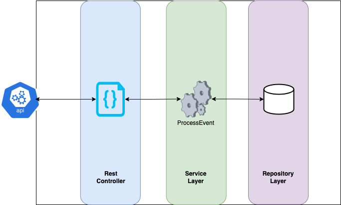
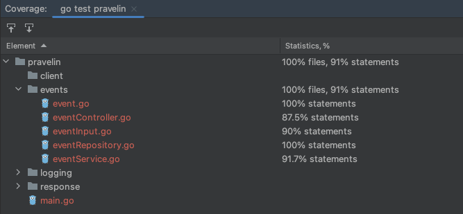
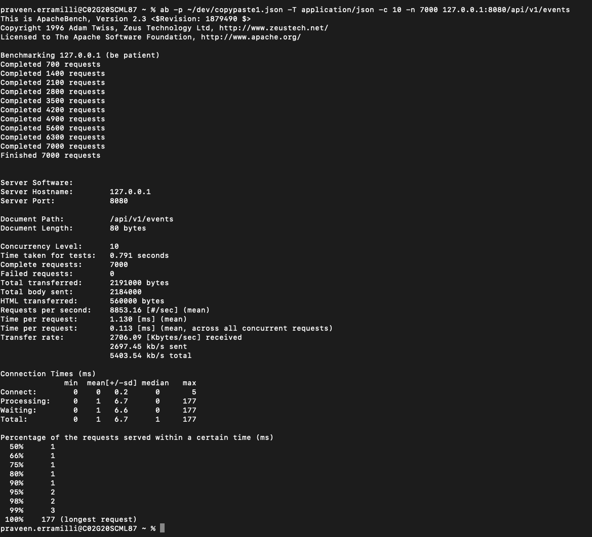

Pravelin Code Test
=================

This project is an implementation of Golang HTTP server that will accept POST requests from multiple clients' websites
## Technologies Used
- Go 1.19
- Limited to Go standard library as per the problem statement

## Assumptions and Limitations
- Session ID is not validated if it is a UUID. Validation only checks if it is a non-empty string. This is done as regex validation on UUID is slower and other validations require importing external libraries
- At every stage of Event struct construction, printing is done to stdout
- Assumed that Submit event (timeTaken event) is the final event for a session. Validation is enforced to prevent further events on the same session ID
- Changed the API URL from / to /api/v1/events to adhere to REST standards. HTML is also edited to use this API
- Swagger doc is not added as we have only a single endpoint. Also, it requires adding a library
- No database is used to keep it simple as per the given problem. All the storage is done in a map with concurrency handled.
- For copyAndPaste event, formId is limited to inputEmail, inputCardNumber, inputCVV by referring to the given HTML. Ideally, these should have been added to a properties file and read in to the application. But for simplicity, these values are hardcoded
- For screenResize event, only the recent resizeFrom and resizeTo are saved in the struct. 
- Given HTML page has a checkbox for "Agree to Terms". This is not handled anywhere in the code as it is not used in the API requests.
- Since it is my first Go project, there are high chances for mistakes in concurrency handling and coding standards. Best practices haven't been followed but tried my best to write bug free code

## Future Improvements
- Validations for inputs and struct constructions can be handled by an external library
- Swagger documentation could be added for APIs
- Right now, the code coverage is 91%. In the future, it can be improved to 95% or more
- Containerization of deployment can be done

## To Build

### Dependencies:
- Go 1.19
## To Run

### Server
- Switch to project directory in a terminal
- Run the command `go run main.go`
- Alternatively, run `go build`. This will generate an executable binary. Now run `./pravelin`
### Client
- Open the  or call the API POST */api/v1/events*

## API
- Method : POST
- URL : http://localhost:8080/api/v1/events
- Example JSON Requests
```javascript
{
  "eventType": "copyAndPaste",
  "websiteUrl": "https://ravelin.com",
  "sessionId": "123123-123123-123123123",
  "pasted": true,
  "formId": "inputCardNumber"
}

{
  "eventType": "screenResize",
  "websiteUrl": "https://ravelin.com",
  "sessionId": "123123-123123-123123123",
  "resizeFrom": {
    "width": "1920",
    "height": "1080"
  },
  "resizeTo": {
    "width": "1280",
    "height": "720"
  }
}

{
  "eventType": "timeTaken",
  "websiteUrl": "https://ravelin.com",
  "sessionId": "123123-123123-123123123",
  "timeTaken": 72,
}
```
## Architecture

## Quality
- Well covered test cases with 91% coverage
- Load tested with ApacheBench to check if multiple concurrent requests from multiple sessions are working

   